<div align="center">

# Vinayak Bhadani
### Demand Planning · AI Supply Chain · Full-Stack Builder — Dubai, UAE

*3 years running real S&OP cycles in the UAE — now shipping AI products that fix the problems I lived every day.*

[**Portfolio**](https://vinayak682.github.io/vinayakbhadani.github.io/) · [**LinkedIn — 7,000+ followers**](https://www.linkedin.com/in/vinayakbhadani/) · [**Email**](mailto:vinayakbhadani1998@gmail.com) · [**WhatsApp**](https://wa.me/971556270561) · [**Resume**](https://vinayak682.github.io/Vinayak-Bhadani-Resume-Demand-Planning-AI-Supply-Chain.pdf)

</div>

<table align="center">
<tr>
<td width="380" align="center" valign="top"></td>
<td width="500" align="center" valign="top"></td>
</tr>
</table>

<div align="center">

</div>

---

## Live AI Products

| Product | What it does | Stack |
|---------|-------------|-------|
| **[Meridian](https://github.com/Vinayak682/meridian)** | CFA-level multi-market equity-research terminal (US · UK · UAE · Singapore) — live TradingView data + a Supabase RAG brain with an auditable multi-agent research pipeline | Supabase · pgvector · Deno Edge Functions |
| **[AlphaOS](https://github.com/Vinayak682/alphaos)** | AI-powered multi-market trading platform — TradingView charts, copy-trading & Claude-driven signals across US, India, UAE & Crypto markets | Next.js · TypeScript · Claude API |
| **[Project Autopilot](https://github.com/Vinayak682/project-autopilot)** | Production-grade supply-chain intelligence platform with real-time metrics, live demos & autonomous AI-agent decision feed | Next.js · TypeScript · Supabase |
| **[Emirates Pride Inventory](https://vinayak682.github.io/emirates-pride-inventory-management/)** | iPad-optimised inventory system in **daily use** across Emirates Pride retail outlets in Dubai — GRN, stock transfers, sales & management reporting | HTML · JS · GitHub Pages (PWA) |
| **[S&OP Copilot](https://sop-copilot.vercel.app)** | Runs Sunday night, delivers your Monday meeting brief before you wake up — AI briefing pack for UAE/GCC manufacturers | Claude API · Next.js · Supabase |
| **[GCC Event Surge Planner](https://event-surge-planner.vercel.app)** | Per-SKU demand forecasting for Ramadan, Eid, DSF, White Friday & National Day. The only tool that knows Ramadan moves 11 days a year | Claude API · Next.js · Supabase |
| **[AI Supply Chain Platform](https://vinayak682.github.io/ai-supply-chain-platform/)** | OTIF Compliance Copilot + Exception Brain — two AI modules for supply-chain exception management | Python · Claude API · Supabase |

---

## Tech Stack

```
Languages:    Python · TypeScript · SQL · DAX
AI/ML:        Claude API · Prompt Engineering · Demand Forecasting (ARIMA, Holt-Winters, ML ensemble)
Frontend:     Next.js · TailwindCSS · shadcn/ui · React · Framer Motion
Backend:      Supabase (PostgreSQL + Auth + RLS) · REST APIs
BI Tools:     Power BI · Excel (Advanced) · Google Sheets
Supply Chain: S&OP · Demand Planning · Procurement · OTIF · Inventory Optimization
Deploy:       Vercel · GitHub Pages · GitHub Actions
```

---

## Recently Shipped
<!-- RECENT_REPOS:START -->
<!-- This section auto-updates daily via GitHub Actions -->
- **[meridian](https://github.com/Vinayak682/meridian)** — Meridian — CFA-level multi-market (US · UK · UAE · Singapore) equity-research terminal: live TradingView data + a Supabase RAG/agentic brain (pgvector hybrid search, auditable multi-agent pipeline). Not investment advice. _(updated 2026-06-28)_
- **[vinayakbhadani.github.io](https://github.com/Vinayak682/vinayakbhadani.github.io)** — Portfolio site — Demand Planning Analyst & AI Supply Chain Builder based in Dubai, UAE _(updated 2026-06-28)_
- **[emirates-pride-inventory-management](https://github.com/Vinayak682/emirates-pride-inventory-management)** — iPad-optimised inventory management system for Emirates Pride retail outlets across Dubai — GRN, stock transfers, sales tracking, tester management & management reporting _(updated 2026-06-19)_
- **[Vinayak682.github.io](https://github.com/Vinayak682/Vinayak682.github.io)** — Vinayak Bhadani – Demand Planning Analyst | Dubai, UAE _(updated 2026-06-16)_
- **[gcc-simulator](https://github.com/Vinayak682/gcc-simulator)** — GCC Business Simulator — Next.js 15 · Supabase · Google Gemini · 8 AI agents. by NayakLabs. _(updated 2026-06-15)_
- **[project-autopilot](https://github.com/Vinayak682/project-autopilot)** — AI-powered supply chain intelligence platform — real-time metrics, live demos & autonomous AI-agent decision feed. Next.js + TypeScript + Supabase. _(updated 2026-06-14)_
<!-- RECENT_REPOS:END -->

---

## Let's Connect

Actively targeting senior **Demand Planning / Supply Chain** roles across UAE's top FMCG, Retail, and Q-Commerce companies — and open to AI-product collaborations.

- **Portfolio:** [vinayak682.github.io/vinayakbhadani.github.io](https://vinayak682.github.io/vinayakbhadani.github.io/)
- **LinkedIn:** [linkedin.com/in/vinayakbhadani](https://www.linkedin.com/in/vinayakbhadani/)
- **Email:** vinayakbhadani1998@gmail.com
- **Location:** Dubai, UAE

---

<div align="center">
<i>"I don't just plan supply chains — I build the tools that plan them better."</i>
</div>
